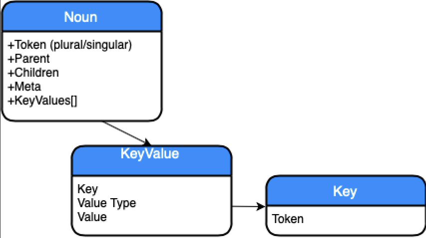
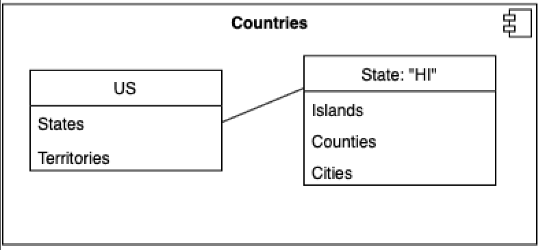

# NounBase: a relational token data service

A lightweight, portable platform, data service library to persist and access nouns by context (no formal schema) in .NET Core in an Sqlite file.


## Getting Started

These instructions will get you a copy of the project up and running on your local machine for development and testing purposes. 

## Who is this for?

.NET core developers needing a token graph persistence and query mechanism. 
It may be useful to applications that don't know in advance the schema or model component relations but need to dynamically capture relations of .

### Demonstration


Reference `NounBase` and obtain the service.
```
var service = services.GetService<ITokenService>();
```

Build a token graph, starting with a null context domain collective noun, Countries, for example:
```
var countries = service.GetToken("Countries" );
```
Add individuals to the collection:
```
var country = service.GetToken("US",countries);
```
Continue to build out other noun relations in the same Collection-Individual pattern:
```
var states = service.GetToken("States", country);
var state = service.GetToken("HI", states);
var cities = service.GetToken("Cities", state);
var city = service.GetToken("Hilo", cities);
```
Subsequent context path result child enumeration with query:
```
var states = service.Get(@"Countries\US\States");
Console.WriteLine((states.Children.Where(x=>x.Token=="HI").Count()==1)? "PASS":"FAIL")
```

## Contributing

Please contribute to this project! There is no roadmap per se, but beneficial pull requests will be merged. In general, the goals are to query and persist semantic relations between tokens without a schema.

## License

This project is licensed under the GNU GPL License - see the GNU-GPLv3-License.txt file for details

